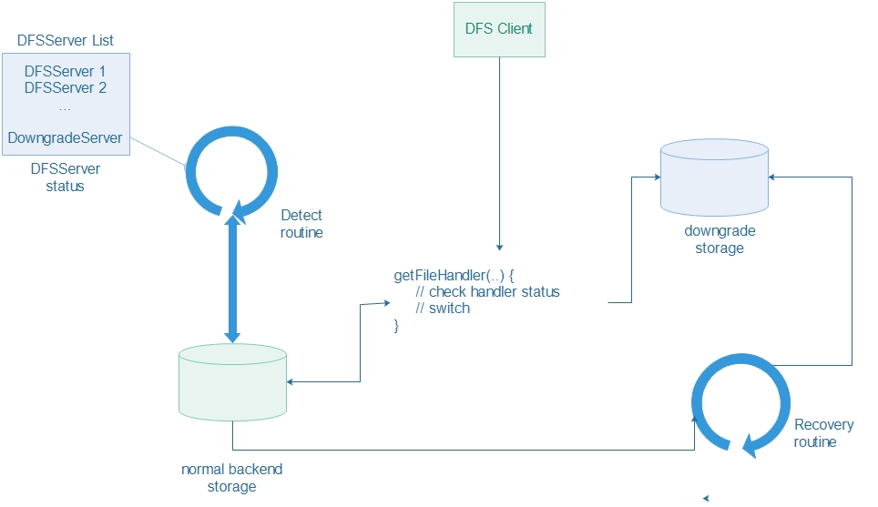
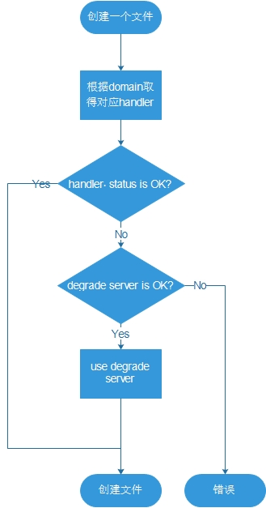

## 降级服务##
 
### 1. 设计要点 ###

1.  系统配置里增加 Downgrade Server 的配置，后端用来保存降级
文件的服务使用 mongodb 。
2.  Shard struct 增加状态字段，用来标示对应的backend存储服
务的状态(在线/离线)。
3.  对 PutFile()和 GetFile() 的获取handler的地方进行重构，提
取到独立的方法中
4.  在getDFSFileHandler(..) 增加对所得Shard状态的判断，如果
可用，则正常运行；如果不可用，则返回降级服务器。
5.  在异常情况下，PutFile把文件写入降级服务器，并向客户端返
回降级状态。
6.  上述降级写入之后，建立一个恢复日志，由专门的恢复 
routine 进行文件的恢复。
7.  GetFile 时，会根据 backend 存储服务的状态，以及降级时间
点，文件时间戳等信息，决定是从降级服务中取文件，还是正常取文
件。
8.  启动专用的 go routine，逐一检测 backend 存储服务的状态，
并根据得到的状态，置位或复位对应 Shard 对象的相应字段。
9.  针对每一个 backend 存储服务，启动一个恢复 routine 进行文
件恢复。
10.  恢复 routine 循环检测对应 Shard 的状态，当为可用时，
从恢复日志中取得数据，对文件进行恢复。

### 2. 逻辑图 ###

### 3. 流程图 ###

